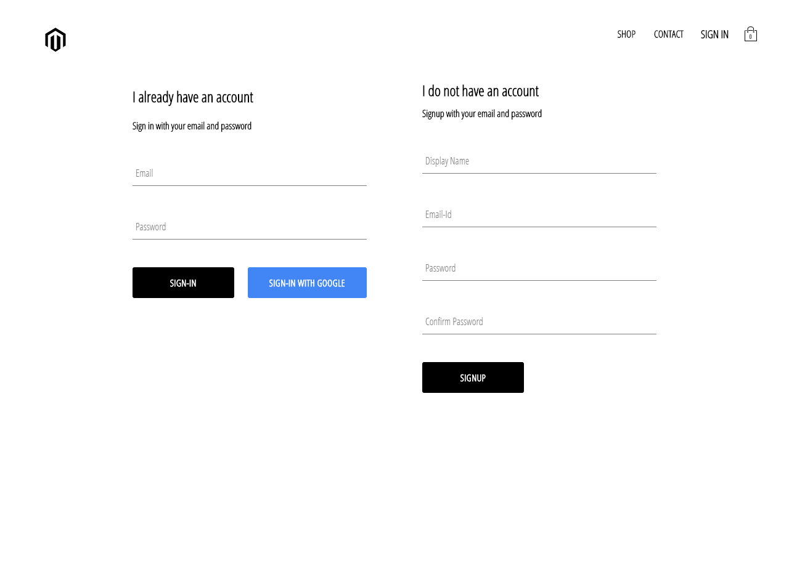
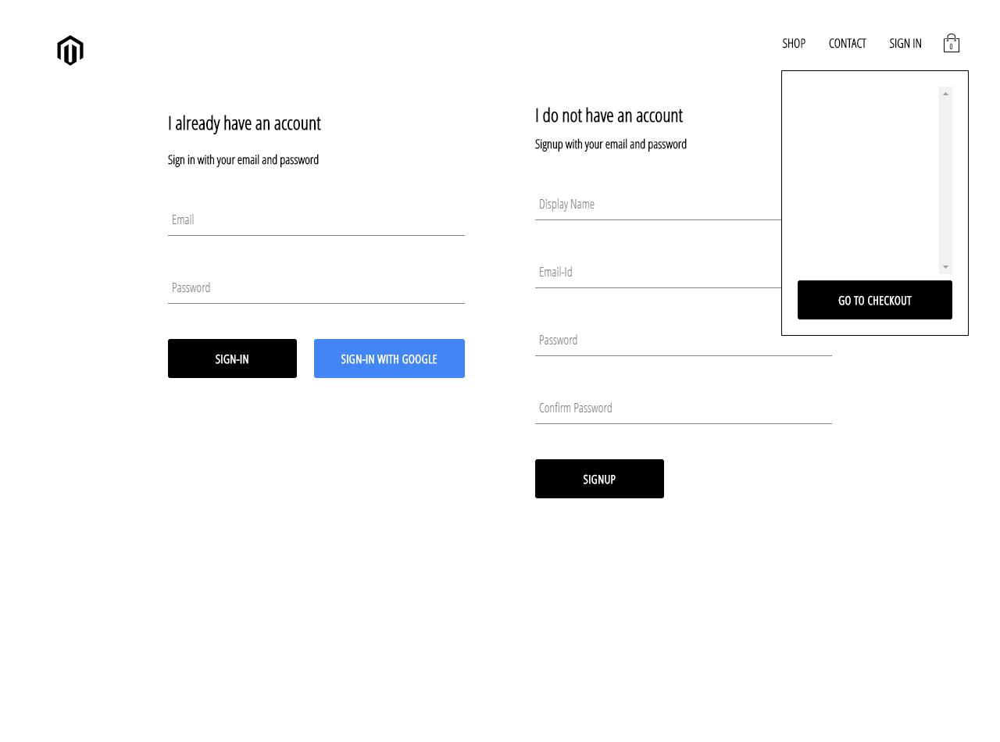

# React-Ecommerce-website
### Work Under Progress

### Version 1 :
* The data is stored locally and not on Firestore
* GraphQL has not been used.
version 1 is hosted [HERE!](https://ak-clothing-attempt-two.herokuapp.com/)

An E commerce platform made using React JS, Redux, Firebase (authentication), Firestore, Stripe API (temporarily creating dummy payment gateway)

The application is composed of the following Features:

### Front-End
* A landing page with animated minimalistic design, with the major categories of items.
* A quick peek page where 5 products of each categories are on display.
* A page with Sign-in and Sign-out components.
* All form related fields are made using reusable components.
* Has a cart feature which opens up and displays the items selected in a summary, also has a checkout button.
* The cart component also allows to edit the contents of the items selected.
* Check out features are yet to be integrated into the appplication. 


### Firebase

* As of this moment I am using firebase for user authentication, also enabled google sign in authentication.
* It is also used to store user data 
* In the future it will also hold all shopping related and cart related dtaa of each user.

**Progress:**
Version 1 completed and hosted

Version 2 Progress: 50%
<br/>


**SCREENSHOTS:**

Landing Page:


---
Product Preview:


---
Sign-in && Sign-Up Page:



Cart Section:



---

## Developed With

* [Visual Studio Code](https://code.visualstudio.com/) - A source code editor developed by Microsoft for Windows, Linux and macOS. It includes support for debugging, embedded Git control, syntax highlighting, intelligent code completion, snippets, and code refactoring
* [React](https://reactjs.org/) - A javascript library for building user interfaces
* [Create react app](https://create-react-app.dev/) - A quick method to start developing a react application.
* [Babel](https://babeljs.io/) - A transpiler for javascript
* [Webpack](https://webpack.js.org/) - A module bundler
* [SCSS](http://sass-lang.com/) - A css metalanguage

---


## Getting Started

These instructions will get you a copy of the project up and running on your local machine for development and testing purposes.

### Prerequisites

The following software is required to be installed on your system:

* Node 8.x
* Npm 3.x

Type the following commands in the terminal to verify your node and npm versions

```bash
node -v
npm -v
```

### Install

Follow the following steps to get development environment running.

* Clone _'react-e-commerce-website.git'_ repository from GitHub

  ```bash
  git clone https://github.com/AdityaKumawat97/react-e-commerce-website.git
  ```

   _OR USING SSH_

  ```bash
  git clone git@github.com:AdityaKumawat97/react-e-commerce-website.git
  ```

* Install node modules

   ```bash
   npm install
   ```


### Starting front-end servers

* Build application

  ```bash
  npm start
  ```
---


